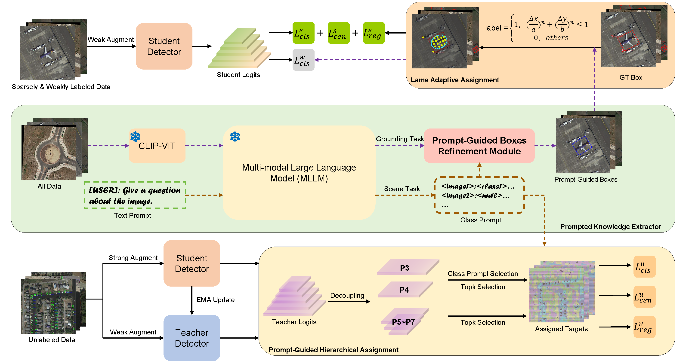

# Enhancing Sparsely-Annotated Object Detection in Remote Sensing via MLLM-Guided Semantic Priors

## Abstract

Object detection in remote sensing imagery remains a significant  challenge, particularly under sparsely annotated conditions where densely packed targets and pronounced inter-class imbalances significantly impede conventional learning paradigms. Although recent advances in dense pseudo-labeling  have demonstrated considerable potential in alleviating the reliance on exhaustive manual annotations, their efficacy is often compromised by heuristic-driven selection ambiguities and unreliable confidence estimation mechanisms. To address the aforementioned limitations, this paper proposes a novel framework termed MLLM-Guided Dense-Label Teacher (MGDT), specifically devised for the sparsely-annotated object detection in remote sensing imagery, which leverages semantic priors derived from Multimodal Large Language Models to enhance both the label assignment process and inter-label consistency. Specifically, Prompted Knowledge Extractor is employed in the pretraining phase to autonomously extract class-level prompts and to generate coarse-grained, prompt-guided bounding boxes, serving as semantically enriched priors for downstream optimization. To further enhance supervision under sparse conditions, we devise two complementary modules: Lam\'e Adaptive Assignment strategy to adaptively refine positive sample assignment in the supervised branch to suppress background noise, and Prompt-Guided Hierarchical Assignment mechanism to perform divide-and-conquer consistency constraints in the unsupervised learning branch. Comprehensive experiments substantiate the superiority of the proposed MGDT framework on  DOTA and HRSC2016 datasets, revealing its performance gains over existing state-of-the-art single-stage baselines on the sparsely-annotated object detection in remote sensing imagery.

---

## Results and Model

### DOTA1.0

| Model Type | Model Name                     |     1%      |     2%      |     5%      |     10%     |
| :--------: | :----------------------------- | :---------: | :---------: | :---------: | :---------: |
| Supervised | Rotated FCOS                   | 49.33/41.18 | 53.69/43.46 | 59.54/48.18 | 59.77/49.79 |
|            | Rotated Retinanet              | 44.17/43.12 | 46.89/45.09 | 51.28/48.86 | 57.05/53.16 |
|            | S2ANet                         | xx.xx/40.14 | xx.xx/41.92 | xx.xx/48.78 | xx.xx/54.39 |
|            | Rotated Faster RCNN            | 45.29/45.44 | 49.83/48.31 | 58.04/51.81 | 63.24/57.75 |
|            | Oriented RCNN                  | 49.04/51.05 | 53.33/53.09 | 59.84/56.85 | 65.98/61.50 |
|            | ReDet                          | 48.87/50.72 | 52.09/52.08 | 60.15/58.01 | 65.41/61.79 |
|    Semi    | Unbaised Teacher (Faster RCNN) | 43.42/43.59 | 48.43/44.97 | 56.24/51.55 | 62.74/57.23 |
|            | Dense Teacher (FCOS)           |      -      | 58.89/47.72 | 61.65/50.82 | 69.84/58.13 |
|            | PseCo (Faster RCNN)            | 43.74/43.03 | 48.73/46.10 | 56.54/52.27 | 63.04/57.66 |
|            | SOOD (RetinaNet)               | 50.91/45.34 | 55.69/47.60 | 60.99/52.84 | 66.24/57.36 |
|            | ARSL (FCOS)                    | 49.47/43.88 | 49.51/44.39 | 56.99/51.38 | 61.06/55.61 |
|            | MCL (FCOS)                     | 48.39/41.90 | 50.53/43.75 | 59.26/51.53 | 64.54/56.17 |
|   Sparse   | Calibrated Teacher (RetinaNet) |      -      |      -      | xx.xx/55.81 |      -      |
|            | S2ANet w/PECL (RetinaNet)      | xx.xx/50.39 | xx.xx/53.81 | xx.xx/57.42 | xx.xx/62.49 |
|            | MGDT (FCOS)                    | 63.23/57.62 | 66.65/59.51 | 69.44/63.23 | 71.75/64.19 |

### Checkpoints

| Dataset | Label Rate | mAP   | Checkpoint                                                   |
| ------- | ---------- | ----- | ------------------------------------------------------------ |
| DOTA    | 1%         | 57.62 | [MGDT_dota_percent1](https://pan.baidu.com/s/1MCR5SCOC7mYpW0uonCoESQ) |
| DOTA    | 2%         | 59.51 | [MGDT_dota_percent2](https://pan.baidu.com/s/15Dp9PtO1MiUOeKZlXNNClw) |
| DOTA    | 5%         | 63.23 | [MGDT_dota_percent5](https://pan.baidu.com/s/1N37f-lOkwi9jOvgQXY5W0Q) |
| DOTA    | 10%        | 64.19 | [MGDT_dota_percent10](https://pan.baidu.com/s/1mUULilPx84wDW-ocS6CsJw) |

---

## Installation

This project is built upon MMRotate 0.3.4, which depends on [PyTorch](https://pytorch.org/), [MMCV](https://github.com/open-mmlab/mmcv), and [MMDetection](https://github.com/open-mmlab/mmdetection). Below are the quick installation steps. For more detailed instructions, please refer to the [Installation Guide](https://mmrotate.readthedocs.io/en/latest/install.html).

```shell
# Create and activate a Conda environment
conda create -n st python=3.8 -y
conda activate st

# Install PyTorch
pip install torch==1.13.1+cu116 torchvision==0.14.1+cu116 torchaudio==0.13.1 --extra-index-url https://download.pytorch.org/whl/cu116

# Install MMCV
pip install -U openmim
mim install mmcv-full==1.7.2

# Install MMDetection and MMRotate
cd /workspace/MGDT/mmdetection
pip install -v -e . # MMDetection 2.28.2

cd /workspace/MGDT/mmrotate
pip install -v -e . # MMRotate 0.3.4

# Install additional dependencies
pip install opencv-python-headless
pip install prettyTable
```

---

## Data Preparation

### 1. Prepare Sparse DOTA Dataset

First, download the DOTA 1.0 dataset using OpenXLab:

```shell
pip install openxlab #安装

pip install -U openxlab #版本升级

openxlab login # 进行登录，输入对应的AK/SK，可在个人中心查看AK/SK

openxlab dataset info --dataset-repo OpenDataLab/DOTA_V1_dot_0 # 数据集信息及文件列表查看

openxlab dataset get --dataset-repo OpenDataLab/DOTA_V1_dot_0 #数据集下载

openxlab dataset download --dataset-repo OpenDataLab/DOTA_V1_dot_0 --source-path /README.md --target-path /path/to/local/folder #数据集文件下载
```

Next, split the DOTA dataset using the script `MGDT/mmrotate/tools/data/dota/split/img_split.py`.
Set the image patch size to 1024. Use the trainval set for training, with a total of 21,046 patches.
For more details on how to split DOTA images into patches, refer to the [MMRotate Guide](https://github.com/open-mmlab/mmrotate/blob/main/tools/data/dota/README.md).


Then, generate the sparse labels using the following script: `MGDT/tools/DOTA_devkit/Split_Sparse_Image_and_Label.py`. Example commands:

```shell
python /workspace/MCL/tools/DOTA_devkit/Split_Sparse_Image_and_Label.py --basepath /workspace/Dataset/OpenDataLab___DOTA_V1_dot_0/raw/DOTA_V1.0/train --outpath /workspace/Dataset/train_split --percent 0.01

python /workspace/MCL/tools/DOTA_devkit/Split_Sparse_Image_and_Label.py --basepath /workspace/Dataset/OpenDataLab___DOTA_V1_dot_0/raw/DOTA_V1.0/val --outpath /workspace/Dataset/val_split --percent 0.01
```

The label files from both train and val need to be manually merged. Alternatively, you can download the preprocessed sparse label data directly from Baidu Netdisk: [DOTA1.0 Sparse Label](https://pan.baidu.com/s/1E61_JIKl-dQK4QRR1pQ2Mw)

Finally, Use `MGDT/tools/DOTA_devkit/split_labeled_and_unlabeled.py` to separate labeled and unlabeled data.


### 2. Prepare Sparse HRSC Dataset

HRSC2016 Sparse Annotation: [HRSC Sparse Label](https://pan.baidu.com/s/1MiQ8QWdMRiVuwx3w3xVsAw)


### 3. Directory Structure
Ensure your dataset is organized as follows:

```shell
/workspace/MGDT

/workspace/GeoChat
├── clip-vit-large-patch14-336
│   ├── pytorch_model.bin
│   ├── tf_model.h5
├── geochat_weights
│   ├── pytorch_model-00001-of-00002.bin
│   ├── pytorch_model-00002-of-00002.bin

/workspace/RemoteCLIP
├── RemoteCLIP-ViT-L-14.pt

/workspace/Dataset
├── DOTAv1_Split
│   ├── sparse
│   │   ├── image_annotation_split_percent1
│   │   │   ├── labeled_annotation
│   │   │   ├── labeled_image
│   │   │   ├── unlabeled_annotation
│   │   │   ├── unlabeled_image
│   │   ├── image_annotation_split_percent2
│   │   ├── image_annotation_split_percent5
│   │   ├── image_annotation_split_percent10
│   │   ├── weakly_pseudo_annotation
│   │   ├── weakly_pseudo_image
│   └── split_ss_dota
│   │   ├── trainval
│   │   ├── test
└── HRSC2016
    ├── FullDataSet
    │   ├── Annotations_Sparse
    ├── ImageSets
    ├── Test    
    └── Train
```

---

## Prompted Knowledge Extractor

### class prompt

1. Configure the GeoChat environment by following the instructions in [GeoChat/README.md](GeoChat/README.md).
2. Download the pre-trained weights for both `geochat` and `clip-vit-large-patch14-336` from Hugging Face.
3. Generate `question.jsonl` using the script:  
   `GeoChat/data/dota/generate_question_from_dota_annotation.py`
4. Generate answers using:  
   `GeoChat/geochat/eval/batch_geochat_scene.py`
5. Refine the generated answers with labeled data using:  
   `GeoChat/data/dota/modify_answer_with_labeled_data.py`
6. Convert the processed data into `.pt` format using:  
   `MGDT/Assinger_Assistent/extract_jsonl_to_pt.py`

Alternatively, you can directly use the pre-generated class prompts located in the  
`MGDT/tools/Assinger_Assistent/` directory.

### weak box

Follow the process in `GeoChat/data/dota/weak_box`:

1. Use `generate_question_from_dota_annotation.py` to generate box text prompt.  
2. Use `GeoChat/geochat/eval/batch_geochat_grounding.py` to infer the jsonl results, and convert them to txt format using `generata_txt_label_from_grouding_result.py`.  
3. Configure the RemoteCLIP environment by following the instructions in [RemoteCLIP/README.md](RemoteCLIP/README.md). Use `RemoteCLIP/filter_weakly_dota_label.py` to filter boxes.  
4. Use `refine_box_with_class_prompt.py` to filter boxes based on class prompt.  
5. Use `GeoChat/geochat/eval/batch_geochat_vqa_refine_box.py` to further filter boxes through a series of VQA tasks, such as `Is there a {} in the center of the image? Answer with yes or no.`

Alternatively, you can download the preprocessed weak box directly from Baidu Netdisk: [weak annotation](https://pan.baidu.com/s/13yQ7rGzpTHNcfVyHxWGhtQ), then use `MGDT/tools/DOTA_devkit/get_weak_image_set.py` generate folder `weakly_pseudo_image`

---

## Training

To train the model using distributed training, run the following command:

```shell
CUDA_VISIBLE_DEVICES=0,1 python -m torch.distributed.launch --nnodes=1 \
--node_rank=0 --master_addr="127.0.0.1" --nproc_per_node=2 --master_port=25580 \
train.py config \
--launcher pytorch \
--work-dir dir \
--resume-from pth
```

For background execution with logging:

```shell
nohup bash -c 'CUDA_VISIBLE_DEVICES=0,1 \
python -m torch.distributed.launch \
    --nnodes=1 \
    --node_rank=0 \
    --master_addr="127.0.0.1" \
    --nproc_per_node=2 \
    --master_port=25410 \
    train.py config \
    --launcher pytorch \
    --work-dir dir' \
> train.log 2>&1 &
```

---

## Testing
To evaluate the model, use the following command:

```shell
CUDA_VISIBLE_DEVICES=0,1 python -m torch.distributed.launch --nnodes=1 \
--node_rank=0 --master_addr="127.0.0.1" --nproc_per_node=2 --master_port=25500 \
test.py config pth \
--launcher pytorch --format-only --eval-options submission_dir=file
```


